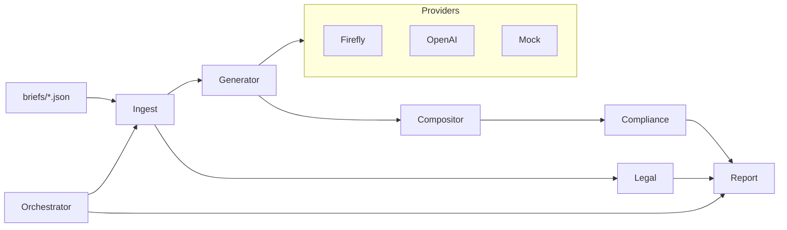

creative-automation-pipeline
============================

Firefly‑first creative automation pipeline that turns a campaign brief into on‑brand social creatives across multiple aspect ratios, with provider auto‑selection, brand/legal checks, provenance, reports, a CLI, and an optional Streamlit UI. Ships with a Mock provider so it runs locally without any API keys.

Features
--------
- Firefly‑first with graceful fallbacks: Firefly v3 → OpenAI Images → Mock
- Agentic Orchestrator watches `briefs/` and triggers generation, tracking coverage
- Deterministic Mock provider for offline/local runs
- On‑brand composition: safe margins, auto line‑wrap, logo scaling 3–6% area
- WCAG AA text contrast check (≥ 4.5:1) and simple color coverage
- Legal scan against prohibited terms
- Provenance sidecars per asset + JSON/CSV reports
- Clean Typer CLI and Streamlit UI (dark theme)
- Tests, pre‑commit, ruff+black, and CI

Quick start
-----------
1) Requirements: Python 3.11

2) Setup
```bash
make setup
```

3) Run sample (offline via Mock)
```bash
make run-sample
```

Typer CLI
---------
```bash
python -m app.main generate \
  --brief briefs/sample_brief.json \
  --out outputs \
  --provider auto \
  --ratios 1:1,9:16,16:9 \
  --locales en-US,es-MX \
  --max-variants 2 \
  --seed 1234 \
  --overlay-style banner \
  --log-json
```

Orchestrator
------------
```bash
python -m app.main orchestrate --iterations 1
```

Streamlit UI (optional)
-----------------------
```bash
streamlit run app/ui.py
```

Providers
---------
- FireflyProvider (preferred): Adobe Firefly Services API v3
- OpenAIImagesProvider (fallback)
- MockProvider: pure Pillow; deterministic; always available

Auto‑selection: `--provider auto` tries Firefly → OpenAI → Mock.

Brief schema (overview)
-----------------------
Required fields:
- campaign_id, brand, markets, audience
- locales, aspect_ratios
- message[locale], call_to_action[locale]
- brand_palette.primary_hex
- products[] with id, name, optional prompt_hints and base_asset

See `briefs/sample_brief.json` for a full example.

Composition rules
-----------------
- Ratios: 1:1 (1024×1024), 9:16 (1080×1920), 16:9 (1920×1080)
- Fit hero with cover/contain without distortion; smart padding when needed
- Overlay message+CTA using bundled font; auto line‑wrap; safe margins
- Logo bottom‑right with margin; scaled to 3–6% of canvas area
- Text contrast meets WCAG AA ≥ 4.5:1
- Provenance sidecar `{image}.prov.json`

Brand & legal checks
--------------------
- Brand rules via `brand/brand_rules.yaml`
- Compliance scoring 0–100 with reasons
- Legal scan from `legal/prohibited_words.txt` (case‑insensitive)

Outputs
-------
- `outputs/<campaign>/<product>/<ratio>/{hero.png, post.png, *.prov.json}`
- `runs/<timestamp>/{run.log,report.json,report.csv}`

Architecture
------------


Project layout
--------------
```
creative-automation-pipeline/
  README.md
  LICENSE
  .env.example
  requirements.txt
  Makefile
  .pre-commit-config.yaml
  .github/workflows/ci.yml
  briefs/sample_brief.json
  brand/brand_rules.yaml
  legal/prohibited_words.txt
  assets/
    source/.gitkeep
    logos/brand_logo.png
    fonts/NotoSans-Regular.ttf
  outputs/.gitkeep
  runs/.gitkeep
  app/
    ...
  tests/
    ...
```

Make targets
------------
- setup: venv + install + bootstrap assets (logo/font if missing)
- fmt: black
- lint: ruff + black --check
- test: pytest -q
- run-sample: generate creatives with Mock provider

Environment
-----------
Copy `.env.example` to `.env` and set keys as needed. The app runs without keys using the Mock provider.

Assumptions & notes
-------------------
- If the bundled font or placeholder logo is missing, `make setup` bootstraps them.
- Firefly and OpenAI adapters gracefully degrade when keys/quotas are unavailable.

Screenshots and report snippet
------------------------------
See the `docs/` folder for architecture and agent communications. You can add screenshots of generated variants and a report snippet after your first run.
