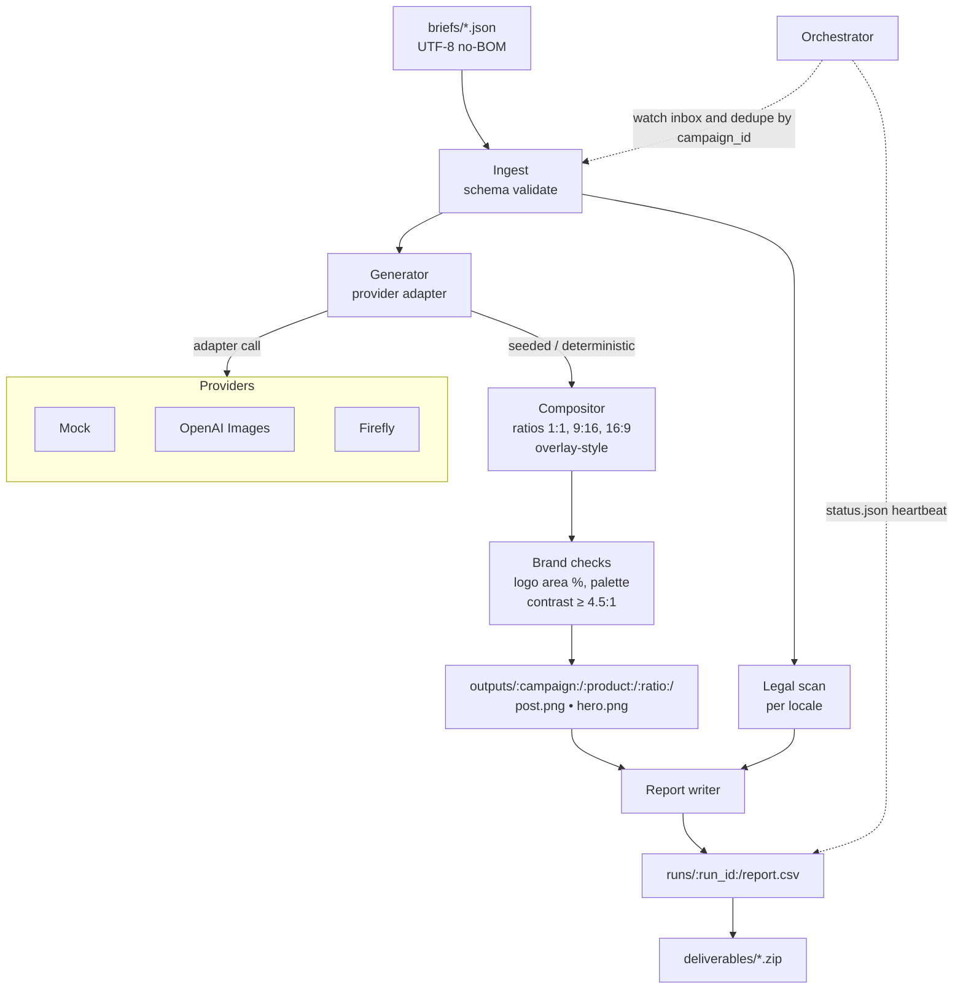

# Creative Automation Pipeline
Generates social creatives from a JSON brief. Provider-agnostic with a local Mock adapter by default. Includes ratio-aware rendering, compliance checks, and provenance sidecars.

## Why
Turn a campaign brief into on-brand assets across common ratios. The pipeline selects whatever providers you enable and writes simple reports so you can review what happened and reproduce runs.

## Quick start
1) Python 3.11

2) Setup
```bash
make setup
````

3. Run sample (no API keys)

```bash
make run-sample
```

## CLI

Run with auto provider selection:

```bash
python -m app.main generate \
  --brief briefs/sample_brief.json \
  --out outputs \
  --provider auto \
  --ratios 1:1,9:16,16:9 \
  --locales en-US,es-MX \
  --max-variants 2 \
  --seed 1234 \
  --overlay-style banner \
  --log-json
```

Run with Mock explicitly:

```bash
python -m app.main generate --brief briefs/sample_brief.json --provider mock
```

## Orchestrator

```bash
python -m app.main orchestrate --iterations 1
```

## UI (optional)

```bash
streamlit run app/ui.py
```

## Providers

Adapters are pluggable and optional. The pipeline runs with Mock only.

* **Mock**: pure Pillow; deterministic; always available
* **OpenAI Images**: optional when keys are set
* **Firefly**: optional when keys are set

**Auto-select behavior:** by default, uses Mock if no external providers are configured. If multiple adapters are enabled, selection order is controlled by your environment config.

## Brief schema (short)

Required:

* `campaign_id`, `brand`, `markets`, `audience`
* `locales`, `aspect_ratios`
* `message[locale]`, `call_to_action[locale]`
* `brand_palette.primary_hex`
* `products[]` with `id`, `name`, optional `prompt_hints` and `base_asset`

See `briefs/sample_brief.json` for a full example.

## Outputs

* `outputs/<campaign>/<product>/<ratio>/{hero.png, post.png, *.prov.json}`
* `runs/<timestamp>/{run.log,report.json,report.csv}`

## Composition

* Ratios: 1:1 (1024×1024), 9:16 (1080×1920), 16:9 (1920×1080)
* Fit hero with cover or contain without distortion. Add padding when needed
* Overlay message and CTA with bundled font. Line wrap with safe margins
* Logo bottom right with margin. Target 3–6% of canvas area
* Text contrast aims for WCAG AA ≥ 4.5:1
* Provenance sidecar `{image}.prov.json`

## Architecture



## Make targets

* `setup`: venv, install, bootstrap assets (logo and font if missing)
* `fmt`: black
* `lint`: ruff and black --check
* `test`: pytest -q
* `run-sample`: generate creatives with the Mock adapter

## Environment

Copy `.env.example` to `.env`. Set keys only if you want external providers. The app runs without keys using Mock.

## Assumptions

* If the bundled font or placeholder logo is missing, `make setup` bootstraps them
* External adapters degrade cleanly when keys or quotas are unavailable

## Demo video

* Stream (primary): [YouTube](https://youtu.be/NcWngSWhqUw)
* Stream (backup): [Filmora](https://app.filmora.io/#/object/d39bdckp7c8q5b1qe4rg)

## Deliverables

* [Architecture.pdf](deliverables/Architecture.pdf)
* [Roadmap.pdf](deliverables/Roadmap.pdf)
* [SUBMISSION.md](deliverables/SUBMISSION.md)
* [Stakeholder_Email.txt](deliverables/Stakeholder_Email.txt)
* [Walkthrough_Script.txt](deliverables/Walkthrough_Script.txt)
