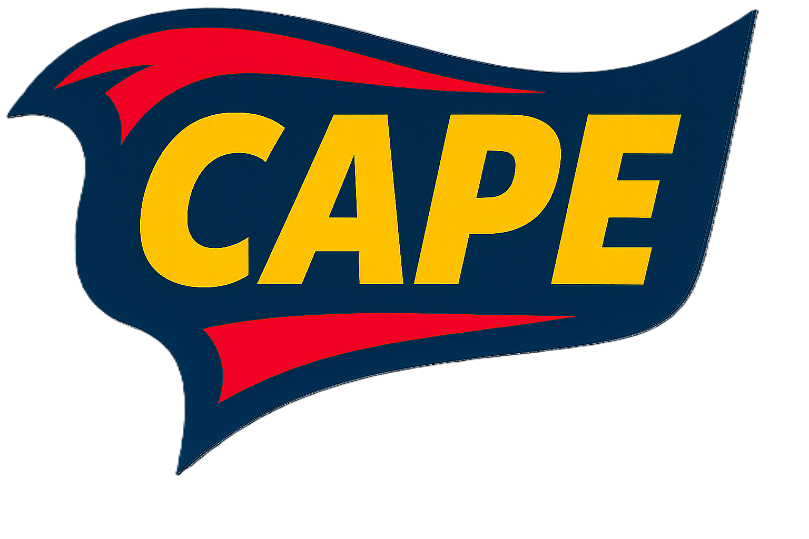
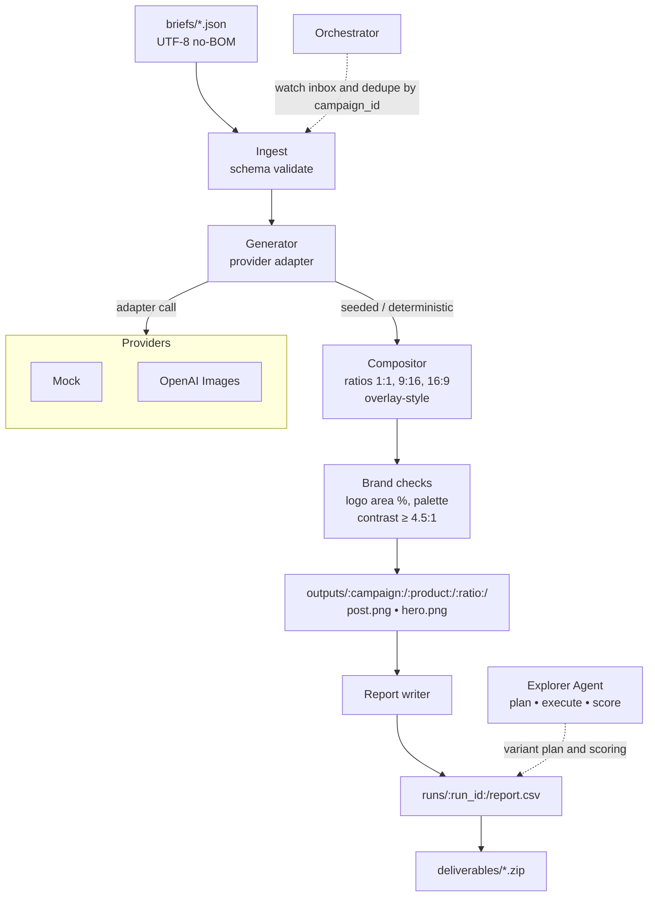

# Creative Automation Pipeline Explorer

<p align="left">
  
</p>

Provider-agnostic pipeline that turns JSON briefs into social creatives with an **Explorer Agent** and a UI for interactive variant discovery. Ships with a deterministic Mock adapter so you can run locally without keys. Writes compliance metrics and provenance sidecars for every asset.

---

## Why CAPE
CAPE makes creative automation **interactive**. Instead of a one-shot render, you can **explore** seeds, ratios, layouts, and prompt hints, then **rank, compare, and select** winners with transparent scoring.

- JSON brief in, on-brand assets out  
- Deterministic local runs for audits and reproducibility  
- Explorer Agent plans and runs variant sweeps, then ranks results  
- Provenance sidecars record adapter, seed, and hashes

---

## Quick start
1) Python 3.11

2) Setup
```bash
make setup
````

3. Run a sample with no API keys (Mock only)

```bash
make run-sample
```

---

## CLI

Run with auto provider selection:

```bash
python -m app.main generate \
  --brief briefs/sample_brief.json \
  --out outputs \
  --provider auto \
  --ratios 1:1,9:16,16:9 \
  --locales en-US,es-MX \
  --max-variants 2 \
  --seed 1234 \
  --overlay-style banner \
  --log-json
```

Run with Mock explicitly:

```bash
python -m app.main generate --brief briefs/sample_brief.json --provider mock
```

Orchestrator loop (single pass):

```bash
python -m app.main orchestrate --iterations 1
```

---

## Explorer Agent (the “E” in CAPE)

The Explorer Agent searches the design space and helps you pick winners.

What it does:

* Plans a grid of variants across **seeds**, **layouts**, and **ratios**
* Executes batches through your provider adapter
* Scores results using **contrast**, **text fit**, and **logo area** heuristics
* Serves an interactive UI to **filter, compare, star, and export** top picks

### Run the Explorer UI

```bash
streamlit run app/ui_explorer.py
```

**UI screens**

* **Controls:** choose seed range, layouts, ratios, and prompt hints
* **Explorer Grid:** masonry of variants with score chips and quick actions
* **Compare:** side-by-side with metric breakdowns and provenance
* **Winners:** export selected assets with a manifest of scores and reasons

---

## Providers

Adapters are pluggable and optional. The pipeline runs with Mock only.

* **Mock**: pure Pillow, deterministic, always available
* **OpenAI Images**: optional when keys are set

Auto-select defaults to Mock if no external providers are configured. If multiple adapters are enabled, selection order is controlled by env config.

### Adapters configuration

| Adapter       | Enable env vars                              | Notes                           |
| ------------- | -------------------------------------------- | ------------------------------- |
| Mock          | none                                         | Default, offline, deterministic |
| OpenAI Images | `OPENAI_API_KEY`, optional `OPENAI_BASE_URL` | Uses current Images API         |

`.env.example`

```dotenv
# Mock requires no keys
# Enable OpenAI by setting your key
OPENAI_API_KEY=
# Optional for self-hosted gateways
# OPENAI_BASE_URL=https://api.openai.com/v1
```

---

## Brief schema (short)

Required:

* `campaign_id`, `brand`, `markets`, `audience`
* `locales`, `aspect_ratios`
* `message[locale]`, `call_to_action[locale]`
* `brand_palette.primary_hex`
* `products[]` with `id`, `name`, optional `prompt_hints`, `base_asset`

See `briefs/sample_brief.json` for a full example.

---

## Outputs

* `outputs/<campaign>/<product>/<ratio>/{hero.png, post.png, *.prov.json}`
* `runs/<timestamp>/{run.log,report.json,report.csv,variant_rank.json,audit.json}`
### Explorer quickstart
```bash
make ui-explorer
# or
streamlit run app/ui_explorer.py
```

Tip: The UI shells into the existing CLI for each variant, so Mock runs work offline and external adapters (like OpenAI Images) work when keys are set via `.env`.


**Provenance sidecar** `{image}.prov.json` includes adapter, seed, version, and SHA-256 of the image file.

---

## Composition rules

* Ratios: 1:1 (1024×1024), 9:16 (1080×1920), 16:9 (1920×1080)
* Fit hero with cover or contain without distortion; add padding as needed
* Overlay message and CTA with bundled font; line wrap with safe margins
* Logo bottom right with margin; target 3–6% of canvas area
* Text contrast aims for WCAG AA ≥ 4.5:1

---

## Architecture



---

## Make targets

* `setup`: venv, install, bootstrap assets (logo and font if missing)
* `fmt`: black
* `lint`: ruff and black --check
* `test`: pytest -q
* `run-sample`: generate creatives with the Mock adapter

---

## Tests

Minimal tests to include:

* **Contrast:** assets with dark overlay should pass AA
* **Logo area:** 3–6% target window
* **Determinism:** same seed and brief produce the same file hash with Mock
* **Explorer ranking:** higher metric sum sorts first

Example test outline:

```python
def test_mock_determinism(tmp_path):
    # run generate twice with same seed, compare SHA-256
    ...

def test_logo_area_bounds():
    # feed known composition, assert pct between 3% and 6%
    ...
```

---

## Environment

Copy `.env.example` to `.env`. Set keys only if you want external providers. The app runs without keys using Mock.

---

## Roadmap

* Add AltTextAgent for ADA descriptions per asset
* Add LocalizationQAAgent for back-translation checks
* Add ChannelPackagerAgent for platform-ready naming and manifests
