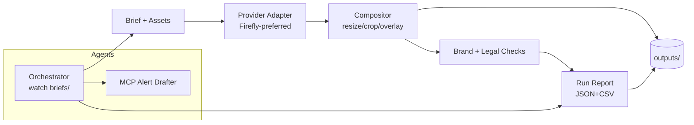

# Creative Automation Pipeline (Firefly-First)

**Firefly-first creative automation pipeline that turns JSON briefs into on-brand social assets across key ratios, with pluggable providers, brand compliance checks, and an agentic orchestrator.**

---

## Why this exists

Enterprise teams need fast, consistent social creatives at scale without sacrificing brand integrity. This repo ingests a **campaign brief**, reuses any available assets, **generates missing hero images** via an adapter (Adobe Firefly preferred), composes final posts for **1:1, 9:16, 16:9**, overlays message/CTA, runs **brand & legal checks**, and writes **reports** you can act on.

---

## Features

* **Firefly-first provider** with clean fallbacks (OpenAI Images or Mock) behind a single interface.
* **Brief → Variants**: JSON/YAML brief drives all outputs; reuses supplied assets when present.
* **Three aspect ratios** out of the box (1:1, 9:16, 16:9) with precise sizing.
* **Overlay engine**: safe text wrapping, brand banner/box, logo placement (\~5% area).
* **Brand checks** (optional): logo present/size, primary color presence, WCAG contrast.
* **Legal checks** (optional): simple prohibited-term flags by market.
* **Reports**: per-run JSON/CSV with counts, timings, flags, and scores.
* **Agentic orchestrator**: watches `briefs/`, triggers runs, tracks coverage/diversity, drafts MCP alerts.
* **Runs anywhere locally**; no cloud keys required when using the **Mock** provider.

---

## Quick start

```bash
# Clone and enter
git clone <private-repo-url> creative-automation-pipeline
cd creative-automation-pipeline

# Set up Python env and deps
make setup

# Optional: set provider keys (Firefly preferred)
cp .env.example .env
# edit .env with FIREFLY_API_KEY, etc.

# Produce sample outputs without any keys (uses Mock provider)
make run-sample
```

Outputs land in `outputs/` and a run report in `runs/<timestamp>/`.

Optional gallery UI:

```bash
streamlit run app/ui.py
```

---

## CLI usage

```bash
python -m app.main generate \
  --brief briefs/sample_brief.json \
  --out outputs \
  --provider auto \
  --ratios 1:1,9:16,16:9 \
  --locales en-US,es-MX \
  --max-variants 2 \
  --log-json
```

Key flags:

* `--provider`: `auto | firefly | openai | mock`
* `--ratios`: comma list, defaults to `1:1,9:16,16:9`
* `--locales`: comma list, defaults from brief
* `--overlay-style`: `banner | bottom-strip | center-card`
* `--seed`: deterministic generation where supported

---

## Brief format (example)

```json
{
  "campaign_id": "fall-refresh-2025",
  "brand": "Acme Beverages",
  "markets": ["US", "MX"],
  "audience": "Busy professionals seeking low-sugar hydration",
  "locales": ["en-US", "es-MX"],
  "aspect_ratios": ["1:1", "9:16", "16:9"],
  "message": {
    "en-US": "Hydrate smarter. Zero sugar. Big flavor.",
    "es-MX": "Hidrátate mejor. Cero azúcar. Gran sabor."
  },
  "call_to_action": {
    "en-US": "Shop now",
    "es-MX": "Compra ahora"
  },
  "brand_palette": { "primary_hex": "#FF3A2E", "secondary_hex": "#111111" },
  "products": [
    {
      "id": "spark-orange",
      "name": "Spark Orange",
      "prompt_hints": "vibrant citrus splash, condensation droplets, energy, lifestyle light bokeh",
      "base_asset": "assets/source/spark_orange.png"
    },
    {
      "id": "cool-lime",
      "name": "Cool Lime",
      "prompt_hints": "cool lime zest, crushed ice, refreshing, minimal studio background"
    }
  ]
}
```

Place briefs in `briefs/` and any reusable assets under `assets/source/`.

---

## Providers

* **FireflyProvider** (preferred): uses Adobe Firefly Services API v3 async endpoints for image generation and related ops. Configure via `.env`:

  ```
  FIREFLY_API_KEY=
  FIREFLY_WORKSPACE_ID=
  ```
* **OpenAIImagesProvider** (fallback): uses Images API if available:

  ```
  OPENAI_API_KEY=
  ```
* **MockProvider**: generates placeholder canvases with prompt/seed text so the pipeline runs locally without external services.

The app selects the first healthy provider in `auto` mode.

---

## Brand and legal checks (optional)

* **Brand rules** in `brand/brand_rules.yaml`:

  * Logo required and constrained to 3–6% of canvas area
  * Primary color presence via HSV tolerance window
  * Overlay contrast ratio ≥ 4.5:1
* **Legal terms** in `legal/prohibited_words.txt`; flagged but do not block output.
* Scores and flags appear in the run report.

---

## Outputs & reports

```
outputs/<campaign_id>/<product_id>/<ratio>/
  hero.png
  post.png

runs/<timestamp>/
  run.log            # JSON lines (structlog)
  report.json
  report.csv
  provenance/*.json  # optional content-credentials sidecars
```

---

## Minimal architecture



---

## Project layout

```
app/
  main.py              # Typer CLI
  ui.py                # Streamlit (optional)
  models.py            # Brief, Product, VariantSpec, Report
  settings.py          # env & config
  pipeline/
    ingest.py          # load brief, assets
    generator.py       # provider calls + prompt assembly
    compositor.py      # ratios, overlay, logo placement
    localize.py        # basic locale support (optional)
    compliance.py      # brand checks
    legal.py           # prohibited terms
    storage.py         # fs adapters; cloud stubs
    report.py          # JSON/CSV summaries
    adapters/
      base.py
      firefly.py
      openai_images.py
      mock.py
  agents/
    orchestrator.py    # folder watcher + job runner
    mcp.py             # Model Context Protocol builders
briefs/
brand/
legal/
assets/
outputs/
runs/
tests/
```

---

## Makefile targets

```bash
make setup       # create venv + install deps
make fmt         # black format
make lint        # ruff + black --check
make test        # pytest -q
make run-sample  # end-to-end run with Mock provider
```

---

## Assumptions & limitations

* Local file-system storage for the PoC; cloud storage adapters are stubbed.
* Compliance and legal checks are heuristic and conservative.
* Localization is basic; swap in glossary or MT provider as needed.
* Content-credentials sidecar is a simple provenance stub for now.

---

## License

Choose your preferred license (MIT/Apache-2.0). Add it as `LICENSE` at the repo root.

---

## Credits

Built for an enterprise creative-automation use case with Adobe Firefly as the preferred image generation back end.
