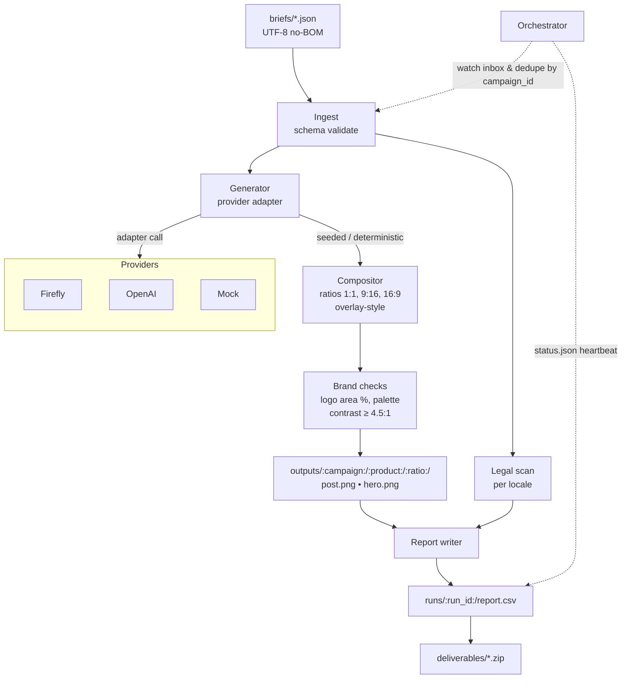

Creative Automation Pipeline
============================

#### Generates social creatives from a brief. Uses a local Mock provider by default.

Why
---
This pipeline turns a campaign brief into on-brand assets across common ratios. It picks a provider that works in your env. It writes simple reports so you can check what happened.

Quick start
-----------
1) Python 3.11.

2) Setup
```bash
make setup
```

3) Run sample (no API keys)
```bash
make run-sample
```

CLI
---
Run with auto provider:
```bash
python -m app.main generate \
  --brief briefs/sample_brief.json \
  --out outputs \
  --provider auto \
  --ratios 1:1,9:16,16:9 \
  --locales en-US,es-MX \
  --max-variants 2 \
  --seed 1234 \
  --overlay-style banner \
  --log-json
```

Run with Mock explicitly:
```bash
python -m app.main generate --brief briefs/sample_brief.json --provider mock
```

Orchestrator
------------
```bash
python -m app.main orchestrate --iterations 1
```

UI (optional)
-------------
```bash
streamlit run app/ui.py
```

Providers
---------
- Firefly: preferred when keys are set
- OpenAI Images: fallback when available
- Mock: pure Pillow; deterministic; always available

Auto-select tries Firefly → OpenAI → Mock.

Brief schema (short)
--------------------
Required:
- campaign_id, brand, markets, audience
- locales, aspect_ratios
- message[locale], call_to_action[locale]
- brand_palette.primary_hex
- products[] with id, name, optional prompt_hints and base_asset

See `briefs/sample_brief.json` for a full example.

Outputs
-------
- `outputs/<campaign>/<product>/<ratio>/{hero.png, post.png, *.prov.json}`
- `runs/<timestamp>/{run.log,report.json,report.csv}`

Composition
-----------
- Ratios: 1:1 (1024×1024), 9:16 (1080×1920), 16:9 (1920×1080)
- Fit hero with cover/contain without distortion; add padding when needed
- Overlay message + CTA with bundled font; line-wrap; safe margins
- Logo bottom-right with margin; target 3–6% canvas area
- Text contrast aims for WCAG AA ≥ 4.5:1
- Provenance sidecar `{image}.prov.json`

Architecture
------------


Make targets
------------
- setup: venv + install + bootstrap assets (logo/font if missing)
- fmt: black
- lint: ruff + black --check
- test: pytest -q
- run-sample: generate creatives with Mock provider

Environment
-----------
Copy `.env.example` to `.env` and set keys if you want external providers. The app runs without keys using Mock.

Assumptions
-----------
- If the bundled font or placeholder logo is missing, `make setup` bootstraps them.
- Firefly and OpenAI adapters degrade sanely when keys/quotas are unavailable.
