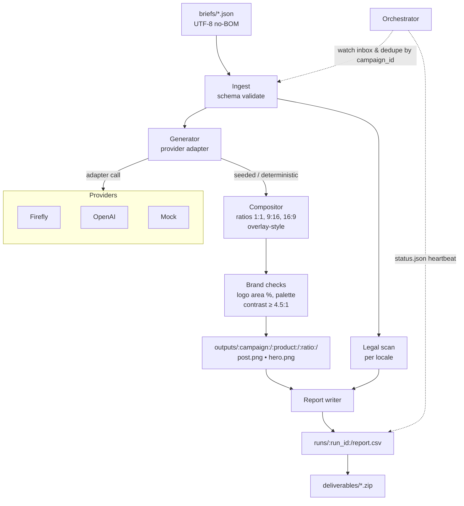

# Architecture
------------

```mermaid
flowchart TB
  %% ------- Main flow (top -> bottom) -------
  Briefs[briefs/*.json<br/>UTF-8 no-BOM]
  Ingest[Ingest<br/>schema validate]
  Generator[Generator<br/>provider adapter]
  Compositor[Compositor<br/>ratios 1:1, 9:16, 16:9<br/>overlay-style]
  Compliance[Brand checks<br/>logo area %, palette<br/>contrast ≥ 4.5:1]
  Outputs[outputs/:campaign:/:product:/:ratio:/<br/>post.png • hero.png]
  Report[Report writer]
  Runs[runs/:run_id:/report.csv]
  Deliverables[deliverables/*.zip]

  Briefs --> Ingest --> Generator -->|seeded / deterministic| Compositor --> Compliance --> Outputs --> Report --> Runs --> Deliverables

  %% ------- Side branches -------
  Legal[Legal scan<br/>per locale]
  Ingest --> Legal --> Report

  %% ------- Providers (stacked) -------
  subgraph Providers
    direction TB
    Firefly[Firefly]
    OpenAI[OpenAI]
    Mock[Mock]
  end
  Generator -->|adapter call| Providers

  %% ------- Orchestrator control (dashed) -------
  Orchestrator[Orchestrator]
  Orchestrator -.->|watch inbox & dedupe by campaign_id| Ingest
  Orchestrator -.->|status.json heartbeat| Runs

```
