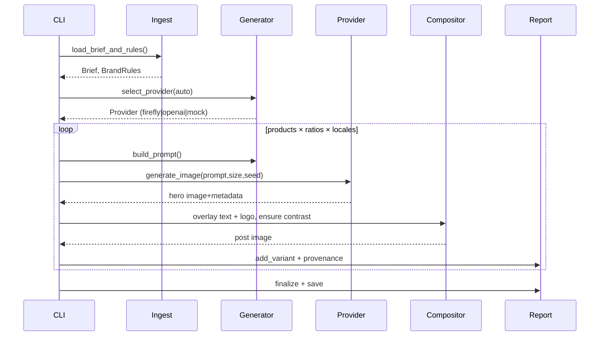
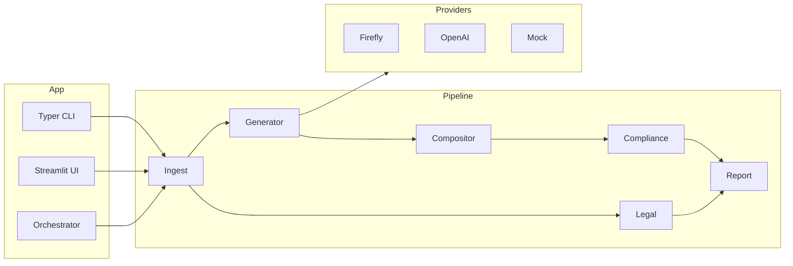

# Architecture and roadmap

## High-level architecture
```mermaid
flowchart TD
  A[Brief (JSON/YAML)] --> B[Ingest]<br/>
  B --> C[Generator]<br/>
  C -->|Auto-select| P{{Providers}}<br/>
  P --> C1[Firefly v3]<br/>
  P --> C2[OpenAI Images]<br/>
  P --> C3[Mock]<br/>
  C --> D[Compositor]<br/>
  D --> E[Compliance]<br/>
  B --> F[Legal]<br/>
  E --> G[Report]<br/>
  F --> G<br/>
  O[Orchestrator] --> B<br/>
  O --> G
```

- Ingest parses brief, validates models, loads brand rules and legal lists
- Generator assembles prompts and calls provider adapter
- Compositor sizes hero, adds overlays, places logo, ensures contrast
- Compliance measures brand adherence and assigns a score
- Legal scans text for disallowed phrases
- Report produces JSON/CSV, thumbnails, and provenance sidecars
- Orchestrator watches `briefs/`, triggers pipeline, maintains `status.json`

## Sequence (generate path)


## Components


## Roadmap
- Week 0–1: MVP local pipeline with Mock provider; CLI; tests; reports
- Week 2–3: Firefly v3 adapter; brand/legal checks refinements; UI polish
- Week 4: Agentic orchestrator + MCP context and email rendering
- Week 5+: Cloud storage adapters; A/B loop; performance optimizations
